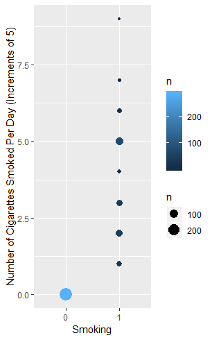

```{r setup, include=FALSE}
knitr::opts_chunk$set(echo = TRUE)
library(tidyverse)
```
# Data Me Pls
### James, Anna, Chris, Amanda

## Pre-Questions Questions
These graphs were done to see the general correlations between two variables. As smoking and most other variables are discrete, we decided to use geom_count() to represent this data best.


```
ggplot(data=babies,aes(x=as.factor(smoke), y=mage, color=..n..))+ geom_count()+ guides(fill=guide_legend(title="Count"))+ labs(x='Smoking', y='Mothers Age')
```
This graph shows the distribution of the mother's age when pregnant and whether or not they smoke. The distribution of the two categories (smoking vs. non-smoking) are very different. There is a fairly even distribution of the non-smokers ages around 25, however, there are two large groups of data centered around ages 23 and 30 for those who do smoke. This finding is could be caused by not a large enough sample size or other factors we have not taken into account.


```
ggplot(data=babies,aes(x=as.factor(smoke), y=med, color=..n..))+ geom_count()+ guides(fill=guide_legend(title="Count"))+ labs(x='Smoking', y='Mothers Education')
```
This graph shows the distribution of Mother's Education (0 being the lowest) and their smoking habits. This graph shows that most of the women who choose to smoke while pregnant have an education level of 2, which represents those who have graduated from high school (as their highest level of schooling). This result is not surprising as the Center for Disease Control reports that adults with less than a high school education are more likely to smoke cigarettes than their peers who have obtained a college degree (https://www.cdc.gov/tobacco/disparities/low-ses/index.htm).


```
ggplot(data=babies,aes(x=as.factor(smoke), y=ded, color=..n..))+ geom_count()+ guides(fill=guide_legend(title="Count"))+ labs(x='Smoking', y='Fathers Education')
```
This graph shows the distributions of Father's Education (0 being the lowest) and the Mother's Smoking habits. This graph, similar to the one before, also shows that fathers that have an education of 2, which represents those who have graduated from high school (as their highest level of schooling), are the most likely out of all of the education groups to have a wife that smokes. This data may or may not be correlated to the Father's Smoking habits as well, but this data set did not report the Father's smoking habits.


```
ggplot(data=babies,aes(x=as.factor(smoke), y=number, color=..n..))+ geom_count()+ guides(fill=guide_legend(title="Count"))+ labs(x='Smoking', y='Number of Cigarettes Smoked Per Day (Increments of 5)')
```
This graph shows the relationship between number of cigarettes smoked per day to general smoking habits. The differences between smokers and non-smokers should be very evident as if one does not smoke, the number of cigarettes one smokes per day should be zero.


```
ggplot(data=babies,aes(x=as.factor(smoke), y=Premature, color=..n..))+ geom_count()+ guides(fill=guide_legend(title="Count"))+ labs(x='Smoking', y='Premature (1=Yes)')
```
This graph shows the amount of babies who were born prematurely were more likely to have had a mother that smoked while pregnant. This data is also very important because this study overall had less participants who smoked while pregnant than who did not. This means that the actual percentage of babies born to mothers who smoke is higher.

A second graph (below) confirms this. 


## Group Questions
1. Mothers who smoke have increased rates of premature delivery (before 270 days).

2. The newborns of mothers who smoke have smaller birth weights at every gestational age (number of days into pregnancy when child is born).

### Why it matters
CHRIS YOU GET TO DO THIS!!!!!!!!!!

### DATA
##Plots for Conclusion 1


```
ggplot(data=babies)+geom_bar(aes(x=factor(Premature),fill=factor(smoke)),position="dodge")+labs(x = "Premature (0 = NO, 1 = YES)",y="Amount of babies",title="Effect of Smoking on Babies")+theme_dark()
```


```
ggplot(data=babies)+geom_bar(aes(x=factor(smoke),fill=factor(Premature)),position="dodge")+labs(x = "Smoke (0 = NO, 1 = YES)",y="Amount of babies",title="Effect of Smoking on Babies")
```

We believe that these two plots provide the best evidence for the Surgeon General's first assertion. In the first plot, one can clearly see that out of all the premature babies, the majority come from women that said they have smoked. This demonstrates that given that a baby is premature, there is larger probability of the mother being a smoker than nonsmoker. The second plot shows that the proportion of premature babies to nonpremature babies is significantly larger in the case where the mother has smoked. This plot shows that given that the mother smokes, there is a larger probability of the baby being premature compared to if the mother didn't smoke. 

##Plot for Conclusion 2

ggplot(data=babies)+geom_smooth(aes(x=gestation,y=bwtoz,color=factor(smoke)),se=FALSE)+geom_vline(xintercept = 270)+labs(x="Gestation Age (Days)",y="Birth Weight (Ounces)",title="How Smoking Affects Birth Weight and Gestation")

This plot clearly shows that the birth weight of babies from mothers who smoke is lower than that of mothers who don't smoke at every gestation age. There is one point where the the two lines intersect that occurs around the gestation age of around 300 days. The vertical line is the gestation age of 270 days, which determines if a baby is premature or not. 

### Recomendations

## Mother's ages and premature babys (Chris)

## (Amanda)

## (James)

## Smoking and Income (Anna)


```
ggplot(data=babies)+ geom_bar(mapping=aes(x=as.factor(smoke), fill=as.factor(inc)),position='stack')+ guides(fill=guide_legend(title="Income"))+ scale_fill_discrete(breaks=c('0','1','2','3','4','5','6','7','8','9'),labels=c('Under 2,500','2,500-4,999','5,000-7,499','7,500-9,999','10,000-12,499','12,500-14,999','15,000-17,499','17,500-19,999','20,000-22,499','22,500+'))+ labs(x= "Smoking (0=No)", title= "Smoking and Income",y= "Count")
```
The relation between Smoking and Income is very important due to the positive relationship between smoking and premature births. A child that is born premature often have a higher chance of medical complications (https://www.mayoclinic.org/diseases-conditions/premature-birth/symptoms-causes/syc-20376730). In this graph, over 50% of the mother's who smoke have incomes under $12,499. This can be helpful to general providers and those who wish to inform people on the risks of smoking while pregnant.
 